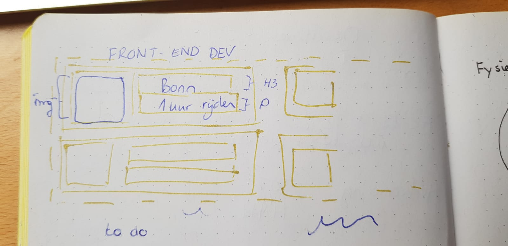
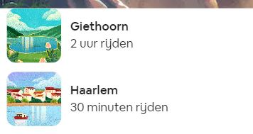

# Procesverslag
**Auteur:** Asa Marjew

Website namaak van AirBnB

**Beoordeling**

Deel 1 - Voorwaarden

- [ ] bevat 2 verschillende pagina’s
- [x] is gerealiseerd met ‘nette’ vanilla HTML, CSS en Javascript
- [x] bevat diverse content
- [x] bevat minimaal één tot in detail uitgewerkte micro-interactie (met JS)
- [x] is toegankelijk
- [x] heeft een professionele uitstraling (in de huisstijl)
- [ ] ziet er goed uit en werkt goed op telefoons (oude iPhone SE tot Galaxy Note)
- [ ] is volledig responsive óf heeft een extra verzorgde surface plane
- [x] Je website staat tijdig online (op GitHub) en is zonder technische problemen te zien. Verwijzingen naar benodigde bestanden (css, js, afbeeldingen, fonts, etc.) werken. Werkt op een desktop/laptop én op een telefoon.
- [ ] Je code is verzorgd en leesbaar. Netjes ingesprongen, van commentaar voorzien, etc.
- [x] Je hebt je vorderingen besproken en je proces vastgelegd en tijdig ontsloten op GitHub.
- [ ] Je kunt je code in het beoordelingsgesprek uitleggen.
- [x] Je vermeldt gebruikte bronnen in je procesverslag.
- [ ] Je kunt je code uitleggen in het eindgesprek.


## Bronnenlijst
1. Airbnb website: airbnb.nl
2. Airbnb style: https://airbnb.design/
3. Font style: https://airbnb.design/introducing-airbnb-cereal/
4. Font download: https://www.cufonfonts.com/font/airbnb-cereal-app
5. https://css-tricks.com/
6. https://www.w3schools.com/
7. https://stackoverflow.com/


## Eindgesprek (week 7/8)

-dit ging goed & dit was lastig-

**Screenshot(s):**

-screenshot(s) van je eindresultaat-


## Voortgang 3 (week 6)

Ik vond het erg lastig om de flexbox toe te passen, hier heb ik dus een schets voor gemaakt op papier om de losse onderdelen te zien.

**Screenshot(s):**





```
#filterLocatie ul {
    display: flex;
    overflow-x: scroll;
    overflow-y: hidden;
    white-space: nowrap;
}

#filterLocatie li {
    display: flex;
    position: relative;
}

#filterLocatie img {
    height: 72px;
    width: 72px;
}

#filterLocatie h4 {
    color: rgb(34, 34, 34);
    font-size: 16px;
    font-weight: 600;
    margin: 0.5em;
    margin-bottom: 0.1em;
    margin-left: 1em;
    margin-right: 5em;
}

#filterLocatie p {
    position: absolute;
    color: rgb(34, 34, 34);
    font-size: 15px;
    font-weight: 400;
    margin: 0.5em;
    margin-top: 0.5em;
    top: 40%;
    left: 5.3em;
}
```


## Voortgang 1 en 2(week 3 en week 5)

### Stand van zaken

HTML structuur gemaakt van de hoofd website van Airbnb.

**Screenshot(s):**
```
<!DOCTYPE html>
<html>
<head>
    <meta charset="UTF-8">
    <meta name="author" content="Asa Marjew">
    <meta name="viewport" content="width=device-width, initial-scale=1">
    
    <title>Remake_Airbnb</title>

    <link href="styles/style2.css" rel="stylesheet" />
</head>


<body>
    <header>
        <a>Het laatste nieuws over onze respons op COVID-19</a>
        <input type="text" placeholder="Waar ga je naartoe?" name="search"/>

        <section id="menu">
            <p>Ontdekken</p>
            <p>Bewaard</p>
            <p>Inloggen</p>
        </section>

        <section>
            <h1>De wereld om<br>de hoek</h1>
            <button>Accommodaties in de buurt bekijken</button>
        </section>
    </header>


    <main>
        <section id="filterLocatie">
            <ul>
                <li>
                    
                    <h4>Putten</h4>
                    <p>1 uur rijden</p>
                </li>
                <li>
                    
                    <h4>Middelburg</h4>
                    <p>1.5 uur rijden</p>
                </li>
                <li>
                    
                    <h4>Maastricht</h4>
                    <p>3 uur rijden</p>
                </li>
                <li>
                    
                    <h4>Amsterdam</h4>
                    <p>1 uur rijden</p>
                </li>
                <li>
                    
                    <h4>Otterlo</h4>
                    <p>7 uur rijden</p>
                </li>
                <li>
                    
                    <h4>Groningen</h4>
                    <p>5.5 uur rijden</p>
                </li>
                <li>
                    
                    <h4>Den Helder</h4>
                    <p>2 uur rijden</p>
                </li>
                <li>
                    
                    <h4>Giethoorn</h4>
                    <p>1.5 uur rijden</p>
                </li>
            </ul>
        </section>

        <section id="filterSoort">
            <h2>Wonen waar je maar wilt</h2>
            <ul>
                <li>
                    
                    <h3>Gehele woningen</h3>
                </li>
                <li>
                    
                    <h3>(Houten) huisjes</h3>
                </li>
                <li>
                    
                    <h3>Unieke accommodaties</h3>
                </li>
                <li>
                    
                    <h3>Huisdieren zijn welkom</h3>
                </li>
            </ul>
        </section>

        <section id="online">
            <h2>Online ervaringen</h2>
            <p>Een wereld aan activiteiten die je samen kunt doen, onder leiding van deskundige hosts.</p>
            <ul>
                <li>
                    
                    <h3>Soepknoedels maken in Shangai</h3>
                </li>
                <li>
                    
                    <h3>Feminisme ontdekken met straatkunst en graffiti</h3>
                </li>
                <li>
                    
                    <h3>Backstage met een New Yorkse goochelaar</h3>
                </li>
                <li>
                    
                    <h3>Cocktailsen genderidentiteit met bartender</h3>
                </li>
            </ul>
            <button>Alles bekijken</button>
        </section>

        <section id="artikel">
            <h2>Word een van de miljoenen hosts op Airbnb</h2>
            <ul>
                <li>
                    
                    <h3>Verhuur je woning</h3>
                </li>
                <li>
                    
                    <h3>Een online ervaring organiseren</h3>
                </li>
                <li>
                    
                    <h3>Een ervaring organiseren</h3>
                </li>
            </ul>
        </section>
    </main>


    <footer>
        <section>
            <h5>Over</h5>
            <ul>
                <li>Hoe Airbnb werkt</li>
                <li>Redactie</li>
                <li>Airbnb Plus</li>
                <li>Airbnb Luxe</li>
                <li>HotelTonight</li>
                <li>Airbnb for Work</li>
                <li>Olympische Spelen</li>
                <li>Vacatures</li>
            </ul>
        </section>

        <section>
            <h5>Community</h5>
            <ul>
                <li>Diversiteit & Verondenheid</li>
                <li>Toegankelijkheid</li>
                <li>Airbnb Associates</li>
                <li>Accommodatieprogramma voor hulpverleners</li>
                <li>Vrienden uitnodigen</li>
            </ul>
        </section>

        <section>
            <h5>Host</h5>
            <ul>
                <li>Je woning verhuren</li>
                <li>Een online ervaring organiseren</li>
                <li>Een ervaring organiseren</li>
                <li>Verantwoord verhuren</li>
                <li>Open Homes</li>
                <li>Informatiecentrum</li>
                <li>Commnity Centrum</li>
            </ul>
        </section>

        <section>
            <h5>Ondersteuning</h5>
            <ul>
                <li>Onze respons op COVID-19</li>
                <li>Helpcentrum</li>
                <li>Annuleringsmogelijkheden</li>
                <li>Buurtondersteuning</li>
                <li>Vertrouwen & Veiligheid</li>
            </ul>
        </section>

        <section>
            <a>Nederlans (NL)</a>
            <a>EUR</a>
            <p>2020 Airbnb, Inc. All rights reserved</p>
            <ul>
                <li>Privacy · </li>
                <li>Voorwaarden · </li>
                <li>Sitemap · </li>
                <li>Bedrijfsgegevens</li>
            </ul>
        </section>
    </footer>


    <script src="js/main.js"></script>
</body>
</html>

```


### Agenda voor meeting

Dit heb ik niet kunnen doen omdat ik later ben ingestroomd. 

-samen met je groepje opstellen-

| student 1      | student 2          | student 3    | student 4        |
| ---            | ---                | ---          | ---              |
| dit bespreken  | en dit             | en ik dit    | en dan ik dat    |
| an dat ook nog | dit als er tijd is | nog een punt | dit wil ik zeker |
| ...            | ...                | ...          | ...              |

### Verslag van meeting

Dit heb ik niet kunnen doen omdat ik later ben ingestroomd.

-na afloop snel uitkomsten vastleggen-
Github desktop setup met Justus.


## Breakdownschets (week 1)


## Intake (week 1)

**Je startniveau:** rood

**Je focus:** -kies uit responsive óf surface plane-

**Je opdracht:** https://www.airbnb.nl/

**Screenshot(s) van de eerste pagina (small screen):**


**Screenshot(s) van de tweede pagina (small screen):**


